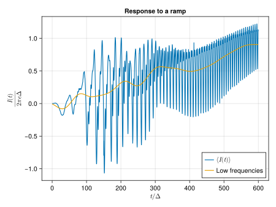

# NonEquilibriumGreenFunction

[](https://github.com/BaptisteLamic/NonEquilibriumGreenFunction.jl/actions)
[](https://codecov.io/gh/BaptisteLamic/NonEquilibriumGreenFunction.jl)
[](https://zenodo.org/badge/latestdoi/623330633)

## Overview

This package solves the non-equilibrium Dyson equation in the time domain with quasi-linear time complexity. It is the research code accompanying:

1. The thesis: [Quantum transport in voltage-biased Josephson junctions](https://www.theses.fr/s210157#)
2. The paper: [Efficient computation of non-equilibrium Green's functions in the time domain](https://arxiv.org/html/2410.11057v1)

## Features

- Solves non-equilibrium Dyson equation in time domain
- Quasi-linear time complexity 

## Examples

### Metal - Quantum Dot - Metal Junction

The notebook `examples/MQDM_junction.ipynb` demonstrates how to compute the Green function of a non-interacting quantum dot connected to two leads and evaluate its current.


### Superconductor - Quantum Dot - Superconductor Junction

The notebook `examples/SQDS_junction.ipynb` shows how to compute the Green function of a non-interacting quantum dot connected to two superconducting leads and evaluate its current.



## Installation

```julia
using Pkg
Pkg.add("https://github.com/BaptisteLamic/NonEquilibriumGreenFunction.jl")
```