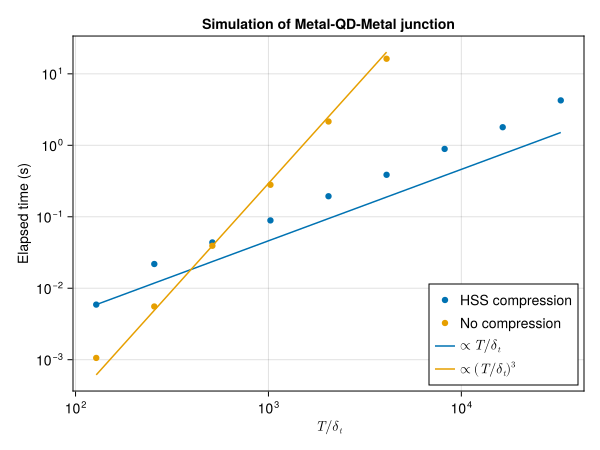
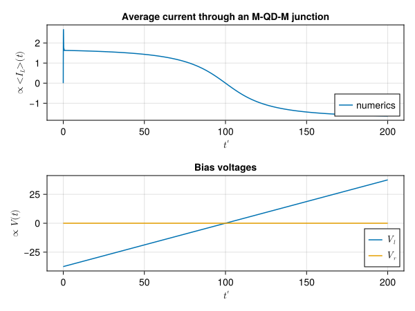
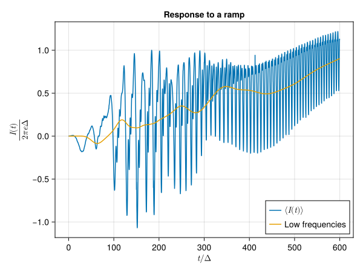

# NonEquilibriumGreenFunction

[](https://github.com/BaptisteLamic/NonEquilibriumGreenFunction.jl/actions)
[](https://codecov.io/gh/BaptisteLamic/NonEquilibriumGreenFunction.jl)
[](https://BaptisteLamic.github.io/NonEquilibriumGreenFunction.jl/)
[](https://zenodo.org/badge/latestdoi/623330633)

## Overview

This package solves the non-equilibrium Dyson equation in the time domain with quasi-linear time complexity. It is the research code accompanying:

1. The thesis: [Quantum transport in voltage-biased Josephson junctions](https://www.theses.fr/s210157#)
2. The paper: [Solving the Transient Dyson Equation with Quasilinear Complexity via Matrix Compression](https://arxiv.org/html/2410.11057v1)

## Features

- Solves non-equilibrium Dyson equation in time domain
- Quasi-linear time complexity via kernel compression (HSS, or circulant for stationary kernels)
- Typed kernel maps with algebra (`+`, `-`, `*`, composition)
- Scalar and Nambu (block) kernels
- Explicit compression/matrix interface with [JLArrays.jl](https://github.com/JuliaGPU/JLArrays.jl) support

## Documentation

The full documentation, including the API reference and the two worked examples, is
hosted at <https://BaptisteLamic.github.io/NonEquilibriumGreenFunction.jl/>.

The documentation is built with [Documenter.jl](https://documenter.juliadocs.org/stable/) and
[Literate.jl](https://github.com/fredrikekre/Literate.jl) on every push. The two worked
examples (Metal–QD–Metal and Superconductor–QD–Superconductor junctions) are executed at
documentation build time, so the published docs always show runnable code.

Build locally with:

```bash
julia --project=docs -e 'using Pkg; Pkg.develop(path=dirname(pwd())); Pkg.instantiate()'
julia --project=docs docs/make.jl
```

## Examples

The examples are Literate scripts in `docs/lit/`, executed at documentation build time.

### Metal - Quantum Dot - Metal Junction

`docs/lit/mqdm.jl` computes the Green function of a non-interacting quantum dot connected to two leads and evaluates its current.




### Superconductor - Quantum Dot - Superconductor Junction

`docs/lit/sqds.jl` computes the Green function of a non-interacting quantum dot connected to two superconducting leads and evaluates its current.



## Benchmarks

Performance benchmarks live in `benchmark/` and use [PkgBenchmark.jl](https://juliaci.github.io/PkgBenchmark.jl/stable/). See `benchmark/README.md`.

## Installation

```julia
using Pkg
Pkg.add("https://github.com/BaptisteLamic/NonEquilibriumGreenFunction.jl")
```
