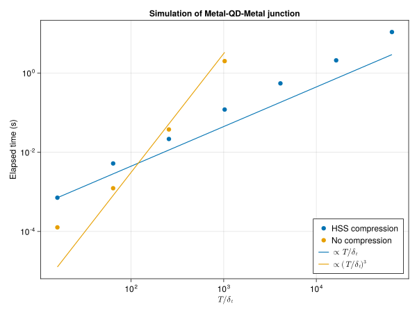

# NonEquilibriumGreenFunction

Research code accompanying the thesis: [Quantum transport in voltage-biased Josephson junctions](https://www.theses.fr/s210157#)
It solves the non-equilibrium Dyson equation in the time domain with quasi-linear time complexity.

