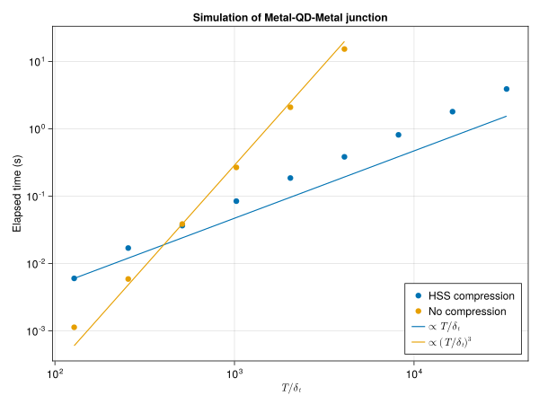

# NonEquilibriumGreenFunction

> :warning: **Package under heavy development/refactoring**

Research code accompanying the thesis: [Quantum transport in voltage-biased Josephson junctions](https://www.theses.fr/s210157#)
It solves the non-equilibrium Dyson equation in the time domain with quasi-linear time complexity.

## Example current accros a Metal - Quantum Dot - Metal junction.
The notebook  shows how to compute the Green function of a non-interacting quantum-dot connected to two leads and 
evaluate its current. 

